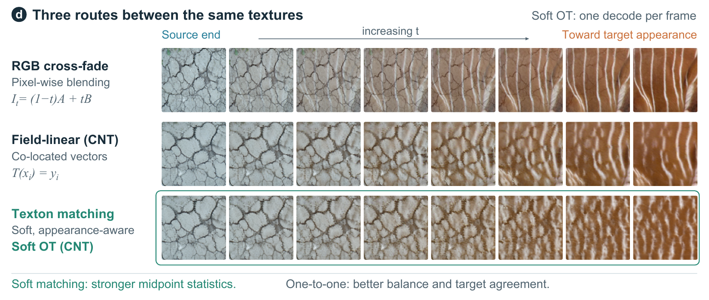

# Texture Interpolation as Texton Matching

Texture interpolation asks what should lie between two textures. Standard methods typically blend pixels or features at corresponding spatial locations, implicitly assuming that co-located elements should be mixed. For unrelated textures, however, this correspondence is arbitrary: a crack at one location has no particular relationship to a fiber at the same location in another image.

We study whether this hidden pairing choice is itself a major determinant of interpolation quality. We represent textures as collections of local appearance vectors, or textons, and replace positional pairing with appearance-aware matching while keeping the encoder, representation, and decoder fixed. This isolates the effect of correspondence from changes in model capacity or training.

Across texture pairs, appearance-aware matching consistently improves the distributional quality of interpolated midpoints over positional feature blending. Soft matching produces the strongest midpoint statistics, whereas one-to-one assignments yield more balanced transitions and closer agreement with the target endpoint. The same intervention also improves a second pretrained texture interpolator without retraining.

These results identify correspondence as a first-class design choice in texture interpolation: meaningful transitions depend not only on how strongly two textures are mixed, but also on which local appearances are mixed with one another.



## Results at a glance

| Method | KID ↓ | FID ↓ | Inc. realism ↑ | Balance *b* ↓ | KID reduction vs. positional |
|---|---|---|---|---|---|
| *CNT, 1,000 pairs* | | | | | |
| Positional blending (field-linear) | 0.030 | 108.0 | 0.925 | 0.048 | – |
| Texton matching: Gaussian moments | 0.024 | 97.9 | 0.926 | 0.105 | 20% |
| Texton matching: Soft OT | 0.021 | 94.7 | 0.942 | 0.081 | 30% |
| Texton matching: Exact OT | 0.033 | 112.8 | 0.951 | 0.044 | −10% |
| *Texture Mixer, 1,000 pairs* | | | | | |
| Positional blending (native) | 0.0121 | 82.4 | 0.948 | 0.056 | – |
| Texton matching: Target mean | 0.0090 | 79.6 | 0.970 | 0.077 | 26% |
| Texton matching: Soft OT | 0.0093 | 79.1 | 0.955 | 0.078 | 23% |

Every number is recomputed by `score_only.py`. Under identical rendering and sampling (Table 2), soft texton matching lowers KID by 38% relative to positional blending, while exact one-to-one OT does not improve on it.

## Installation

Tier 1 (CPU only):

```bash
pip install -e .
```

Tier 2 (feature extraction; one GPU recommended, CPU is 10 to 30 times slower):

```bash
bash install/scoring.sh
```

Tier 3 (rendering; one CUDA GPU, T4 or better; Texture Mixer runs in its own conda environment):

```bash
bash install/cnt.sh
conda env create -f install/environment_tm.yml && conda activate texton-matching-tm
bash install/texture_mixer.sh
```

## Reproducing the paper

Three tiers, each with one entry command. Every table and figure below maps to
a script or a notebook.

**Tier 1, score.** Recomputes every macro traceable to a cached file and compares
it with the paper. About 3 minutes on a 10-core CPU. Reads the packed inputs in
`evidence/tier1/` and writes `docs/CHECK.md` (245 MATCH, 0 MISMATCH, 257 rows).

```bash
python score_only.py
```

**Tier 2, rescore.** Turns a folder of rendered midpoints into the features Tier 1
reads, then runs Tier 1. Budget 10 to 20 minutes on a GPU for the full protocol.
The rendered images are released upon publication.

```bash
python rescore.py --images RENDERED_DIR --data-root OUT_DIR --dtd-root DTD_DIR --table all --run-score-only
```

**Tier 3, render.** One script per table renders its midpoints from scratch and
accepts `--n-pairs 5` for a smoke test of a few minutes. A full run takes from
under an hour to a few hours on one GPU.

```bash
python experiments/cnt_1000.py --cnt-root CNT_DIR --dtd-root DTD_DIR --out RENDERED_DIR/tm_scale1000 --data-root OUT_DIR --n-pairs 1000
```

| Paper item | Reproduce with | Status |
|---|---|---|
| Figure 1 | `notebooks/supplementary_studies/figure_candidate_factory.ipynb` | notebook |
| Table 1 | `experiments/cnt_1000.py`, `experiments/tm_1000.py` | script |
| Figure 2 | `notebooks/canonical_rescore_128px.ipynb` | notebook |
| Table 2 | `experiments/cnt_matched_200.py` | script |
| Table 3 | `experiments/generative_120.py` | script |
| Figure 3 | `notebooks/generative_comparison_gpt_staging.ipynb` | notebook |
| Figure 4 | `experiments/anchor_mixtures.py` | script |
| Figure 5 | `notebooks/supplementary_studies/anchor_mixtures_and_stability.ipynb` | notebook |
| Appendix Table 4 | `experiments/generative_120.py` | script |
| Appendix Figure 6 | `notebooks/generative_comparison_gpt_staging.ipynb` | notebook |
| Appendix Table 5 | `experiments/vacher_50.py` | script |
| Appendix Table 6 | `experiments/primitives_120.py` | script |
| Appendix Table 7 | `experiments/rules_200.py` | script |
| Appendix Table 8 | `notebooks/supplementary_studies/feature_space_spread_dino_sam.ipynb`, `notebooks/supplementary_studies/ot_metric_forensics_cnt.ipynb` | notebook |
| Appendix Table 9 | `notebooks/supplementary_studies/vortex_observer_realism.ipynb` | notebook |
| Appendix Figure 7 | `notebooks/entropy_sweep_plan_alignment_timing.ipynb` | notebook |
| Appendix Table 12 | `notebooks/supplementary_studies/repeated_operations_ot_vs_texture_mixer.ipynb` | notebook |
| Appendix Table 13 | `experiments/runtime_120.py` | script |
| Appendix Figure 8 | `notebooks/canonical_rescore_128px.ipynb` | notebook |
| Appendix Figure 9 | `notebooks/canonical_rescore_128px.ipynb` | notebook |
| Appendix Figure 10 | `experiments/alignment.py` | script |
| Appendix Figure 11 | `experiments/anchor_mixtures.py` | script |
| Appendix Figure 12 | `experiments/anchor_mixtures.py` | script |
| Appendix Figure 13 | `notebooks/supplementary_studies/anchor_mixtures_and_stability.ipynb` | notebook |
| Appendix Figure 14 | none | Not reproducible: raw outputs discarded |
| Appendix Figure 15 | `notebooks/entropy_sweep_plan_alignment_timing.ipynb` | notebook |
| Appendix D.6 (encoding ceiling) | `experiments/ceiling_120.py` | script |

`docs/COVERAGE.md` lists the data each row needs, with the paper labels, and `docs/PROVENANCE.md`
records the limits of individual rows.

## Colab

Download this repository as a zip and upload it through Colab's file panel. Use
a GPU runtime.

`colab/reproduce.ipynb` (CNT):
1. Upload the zip and run the cells from the top through the install cell.
2. Restart the session when the install cell says so.
3. Run the rest of the notebook.
4. The last cell prints `OVERALL: PASS`.

`colab/reproduce_tm.ipynb` (Texture Mixer):
1. Upload the zip and run the cells from the top through the render cell.
2. Restart the session at the "Restart the session now" cell.
3. Run the rest of the notebook.
4. The last cell prints `OVERALL: PASS`.

`colab/README.md` lists every cell.

## Evaluation protocol

Every method, including the GPT comparator, goes through one scoring chain
(`texton_matching/scoring.py`, `rescore.py`, `score_only.py`).

**Preprocessing.** Each output is converted to RGB and resized to 128×128 with
Pillow's `resize`. For feature extraction the 128-px image is resized to 256×256,
then bilinearly to 299×299 (Inception) or 518×518 (DINOv2), and normalized with
the ImageNet mean and standard deviation. Endpoints of the 1,000-pair benchmark
are stored at 128×128 and upsampled to 256×256 before CNT encoding.

**Observers.** Inception-v3 (torchvision `IMAGENET1K_V1`, classifier removed,
2,048-d pool features) for KID, FID and the Inception realism. DINOv2 ViT-S/14
through timm, `vit_small_patch14_dinov2.lvd142m` (384-d features), for the DINO
realism and the balance score; this is not the Hugging Face `dinov2-base` model.
LPIPS (AlexNet) for the ceiling (Appendix D.6) and alignment (Appendix Figure 10) studies.

**Reference pool.** 2,819 DTD images (seed 2819, 60 per category), cached as
`ref_inc.npy` and `ref_dino.npy` under `evidence/tier1/matching_ablation/`.
Appendix D.6 uses a 5,640-image reference of native 128-px windows.

**Metrics.**
- **KID:** unbiased estimator with the cubic polynomial kernel
  `k(x, y) = (x·y/d + 1)^3`. The reference self-term subtracts the kernel's
  diagonal (its trace), not the number of reference images.
- **FID:** Fréchet distance between Gaussians fitted to generated and reference
  features (`scipy.linalg.sqrtm`).
- **Realism:** the k-NN manifold score of Kynkäänniemi et al., k = 3, 1,000
  reference samples per manifold, radii above the median removed, median over
  five manifolds (seeds 0 to 4). Values of at least 1 lie inside the manifold.
- **Balance:** `place = d(M,A) / (d(M,A) + d(M,B))` with DINOv2 distances to the
  CNT reconstructions of the endpoints; balance is `|place - 0.5|`, reported as a
  median.
- **Paired tests:** ΔKID intervals are paired leave-one-pair-out jackknife 95%
  intervals (estimate ± 1.96 standard errors). Realism differences use a paired
  bootstrap of the median. Balance and target-gap p-values are Wilcoxon
  signed-rank tests.

**KID estimator per table.**

| Estimator | Tables |
|---|---|
| Full reference, trace-corrected | Table 3 and Appendix Table 4, Table 2, the Texture Mixer block of Table 1, Appendix Table 6, Appendix D.6, every ΔKID |
| 20 subsamples of size min(1,000, number of images), averaged; trace-corrected | the CNT block of Table 1, Appendix Table 7 |

## GPT-Image-1.5 comparator

The comparator is a proprietary image-editing model used as a black box. The
repository ships the prompts, the call ledger, the run manifests and the per-pair
scores; it does not call the API.

**What was called.** Model `gpt-image-1.5` (an Azure deployment) through the
image-editing interface (`images.edit`, API version `2025-04-01-preview`), one
serial call per pair and prompt. Every call used quality `high`, input fidelity
`high`, output size 1024×1024, PNG, `n = 1`, and two ordered reference images, A
first and B second. The inputs are the endpoint files of the 120-pair set as
stored (256×256 RGB PNG). No call needed a retry. Sources, under
`evidence/gpt_image_1_5_experiment/`: `config.yaml`, `runs/call_ledger.jsonl`,
`runs/*/manifest.jsonl`.

**Prompts.** Verbatim from `prompts/`. P1 (symmetric natural midpoint, series S2)
gives "GPT symmetric":

```text
You are given exactly two reference images in order: reference image 1 is texture A and reference image 2 is texture B. Generate one single square image M representing a coherent, plausible perceptual texture midpoint between A and B at t = 0.50.

M must be one internally consistent texture that could plausibly exist on its own. Interpolate texture-level properties such as periodicity, orientation, topology, motif or element shape, spatial scale, density, regularity, material appearance, local contrast, and color distribution. Preserve meaningful evidence of both endpoints and aim for approximately equal perceptual texture distance from A and B. Prefer structural and statistical texture cues over semantic object identity.

Do not make a pixel-space blend, alpha blend, cross-fade, transparent overlay, split image, side-by-side composition, collage, or simple average of colors. Do not merely paste motifs from A and B together. Do not include A, B, labels, text, borders, margins, or a presentation panel. Output only M, edge-to-edge. The definition is symmetric: swapping the order of A and B should not change the intended midpoint.
```

P2 (directed midpoint that keeps the layout of A and moves its appearance halfway
to B, series S1) gives "GPT directed":

```text
You are given exactly two reference images in order: reference image 1 is source texture A and reference image 2 is target-appearance texture B. Generate one single square midpoint texture M at t = 0.50 for a directed source-layout appearance interpolation from A toward B.

Preserve the dominant spatial organization, layout, orientation, and large-scale arrangement of A, while moving the appearance of its local texture elements halfway toward B. Interpolate local motif shape, scale, density, regularity, material, local contrast, and color statistics toward B. The result must be one coherent, plausible texture, not two overlaid patterns. Semantic objects that are incidental to texture should not dominate the interpolation.

Do not make a pixel-space blend, alpha blend, cross-fade, transparent overlay, split image, side-by-side composition, collage, or simple average of colors. Do not include A, B, labels, text, borders, margins, or a presentation panel. Output only M, edge-to-edge. This task is directed: A supplies layout and B supplies the target appearance.
```

The harness also contains a minimal prompt, P0, used in the pilot and the prompt
ablation, and a path prompt, P3. Neither enters a paper table.

**Scored outputs.** 120 pairs × 2 prompts = 240 outputs, `images/S1/{k}_mid.png`
(P2) and `images/S2/{k}_mid.png` (P1), joined on the 120 keys of
`pairs_120/pairs.csv` and scored through the chain above unchanged. Their hashes
are in `evidence/gpt_call_summary.csv`. Per-pair realism, DINOv2 distances and
placement are in `evidence/gpt_pair_scores.csv`; `score_only.py` recomputes the
GPT rows from cached features.

**Latency.** The median latency over the 240 scored calls is 38.4 s
(`experiments/gpt_call_stats.py`).

**Reproducibility.** The API outputs are stochastic and the model is proprietary,
so generation cannot be repeated. The scores are reproducible from the outputs,
which are released upon publication.

**Figure.** Figure 3 shows the first three pairs by id, with columns A |
soft OT | GPT directed | GPT symmetric | Texture Mixer | B; Appendix Figure 6 shows the
first eight.

## Repository layout

| Path | Contents |
|---|---|
| `score_only.py` | Tier 1: recompute every file-traceable macro, write `docs/CHECK.md` |
| `rescore.py` | Tier 2: rendered images to the feature caches Tier 1 reads |
| `experiments/` | Tier 3: one render script per table or figure, plus `gpt_call_stats.py` and `pack_tier1.py` |
| `texton_matching/` | CNT wrapper, matching rules, scoring, data helpers |
| `colab/` | Two end-to-end Colab notebooks with PASS/FAIL checks |
| `notebooks/` | The 28 original experiment notebooks, curated |
| `install/` | Environment and checkpoint installers |
| `evidence/` | `tier1/` (packed Tier 1 inputs), `paper_numbers/` (the paper's macros), demo pairs, per-pair GPT scores, the GPT harness |
| `docs/` | `CHECK.md`, `COVERAGE.md`, `INVENTORY.md`, `PROVENANCE.md`, `INSTALL_NOTES.md` |
| `assets/` | README image |

## Citation

Anonymous. Texture Interpolation as Texton Matching. Under review at ICLR 2027.

```bibtex
@misc{anonymous2027textureinterpolation,
  title  = {Texture Interpolation as Texton Matching},
  author = {Anonymous},
  note   = {Under review at ICLR 2027}
}
```

## License

MIT. CNT, Texture Mixer and Vacher et al. are third-party code under their own
licenses; the install scripts download them.
