# GPT Image 1.5 texture-midpoint pilot and all-series preview

This page shows the frozen three-pair pilot and the subsequently authorized
high-quality S1–S5 preview. Endpoints are always the untouched source files;
labels are outside the image crops. Click any path strip to inspect it at full
resolution.

`gpt-image-1.5` is evaluated as a foundation-model comparator, not as ground
truth or an oracle. These examples are prompt-compliance and behavior
diagnostics; they do not establish a scientific winner. The visual observations
below are post-hoc review, not hidden model reasoning.

## Expanded high-quality preview — S1 through S6

This preview used the same ordinary, periodic, and semantic pairs as the first
pilot. It contains 54 nominal S1–S5 cells, implemented as 45 unique paid calls
plus nine exact cross-series reuses. Every request used high quality, two
ordered reference images, high input fidelity, and a 1024×1024 PNG output.

- **S1:** P2 directed source-layout midpoint.
- **S2:** P1 symmetric natural midpoint.
- **S3:** high-quality P0/P1/P2 prompt comparison.
- **S4:** two independent A→B and two independent B→A P1 samples.
- **S5:** independent prompts at `t=0.1,...,0.9`, with original A/B at the ends.
- **S6:** post-hoc qualitative regime review below; no additional API call.

### Pair 0445 — ordinary: marbled → wrinkled

#### S1/S2/S3 — high-quality prompt comparison

[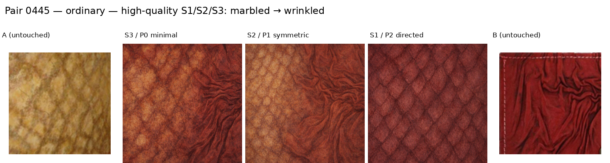](runs/preview_all_series_20260901/preview_figures/S1_S3/0445_high_quality_prompts.png)

P0 and P1 synthesize mixed marbled/wrinkled fields. P2 instead imposes a
regular diamond-like structure, so directed source-layout adherence is not
unambiguous for this pair.

#### S4 — order and repeat variation

[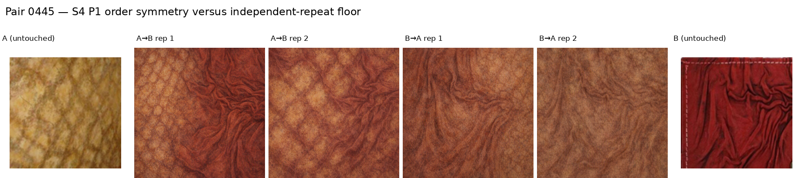](runs/preview_all_series_20260901/preview_figures/S4/0445_symmetry_repeats.png)

The A→B samples are redder and display stronger wrinkle structure than the
B→A samples. Repeat-to-repeat layout changes are also visible, so a larger
paired analysis is needed to separate order sensitivity from stochasticity.

#### S5 — full independently prompted path

[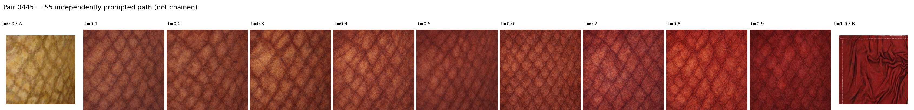](runs/preview_all_series_20260901/preview_figures/S5/0445_path_t00_t10.png)

Color changes broadly toward B, but the generated interior path locks onto a
diamond-like structure early and does not approach B's wrinkle topology
smoothly. The transition to the untouched B endpoint remains abrupt.

### Pair 0725 — periodic: crosshatched → meshed

#### S1/S2/S3 — high-quality prompt comparison

[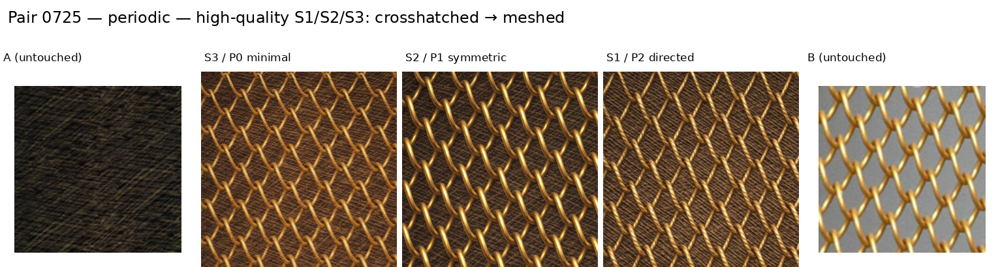](runs/preview_all_series_20260901/preview_figures/S1_S3/0725_high_quality_prompts.png)

All three prompts strongly favor an explicit golden mesh. P2 retains a dark
crosshatched substrate, but the target motif dominates every midpoint.

#### S4 — order and repeat variation

[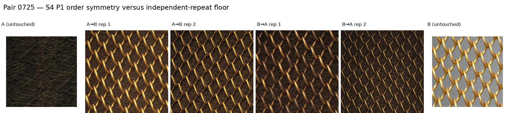](runs/preview_all_series_20260901/preview_figures/S4/0725_symmetry_repeats.png)

Order and independent repeats visibly change mesh scale, density, geometry,
and brightness. These examples show why S4 needs a stochastic repeat floor.

#### S5 — full independently prompted path

[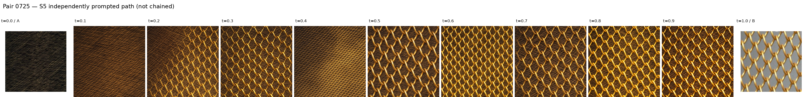](runs/preview_all_series_20260901/preview_figures/S5/0725_path_t00_t10.png)

The path introduces explicit mesh by `t=0.2`; motif scale and density then
fluctuate rather than changing monotonically. The generated `t=0.9` frame also
differs sharply from the untouched B endpoint's gray background.

### Pair 0656 — semantic intrusion: frilly → veined

#### S1/S2/S3 — high-quality prompt comparison

[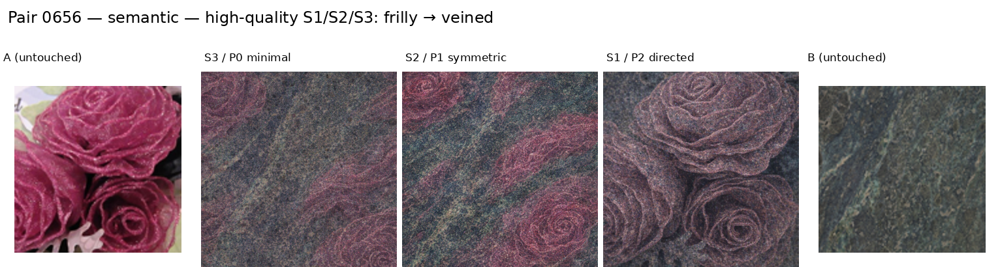](runs/preview_all_series_20260901/preview_figures/S1_S3/0656_high_quality_prompts.png)

All prompts retain recognizable roses. P2 most strongly preserves A's object
layout while transferring B's darker veined or mineral-like appearance.

#### S4 — order and repeat variation

[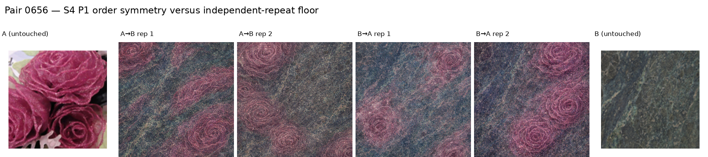](runs/preview_all_series_20260901/preview_figures/S4/0656_symmetry_repeats.png)

Every sample remains rose-like, but the count, placement, scale, and material
vary considerably across both order and independent repeats.

#### S5 — full independently prompted path

[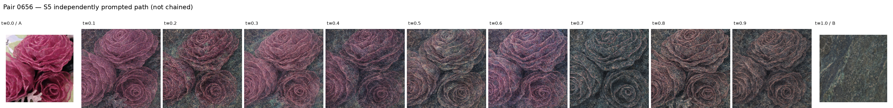](runs/preview_all_series_20260901/preview_figures/S5/0656_path_t00_t10.png)

All nine generated interior frames preserve rose objects while changing color
and surface material. The semantic source layout persists through `t=0.9`,
followed by an abrupt transition to B's non-object texture at `t=1.0`.

### S6 — qualitative regime stratification

Across these three examples, the ordinary path changes appearance more readily
than topology, the periodic path locks onto the target mesh but varies its
scale non-monotonically, and the semantic path preserves recognizable source
objects almost to the endpoint. This is a post-hoc preview observation—not a
threshold, statistical result, or replacement for the full frozen subsets.

## Initial 10-call medium-quality pilot

### Pair 0445 — ordinary: marbled → wrinkled

#### Low-quality smoke test — P0_MINIMAL

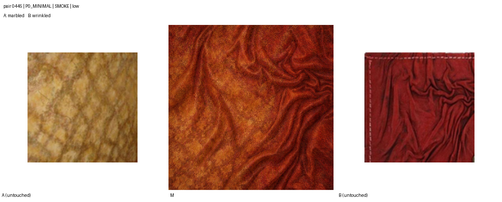

#### P0_MINIMAL — medium

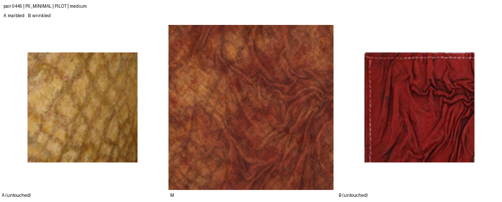

#### P1_PERCEPTUAL_SYMMETRIC — medium

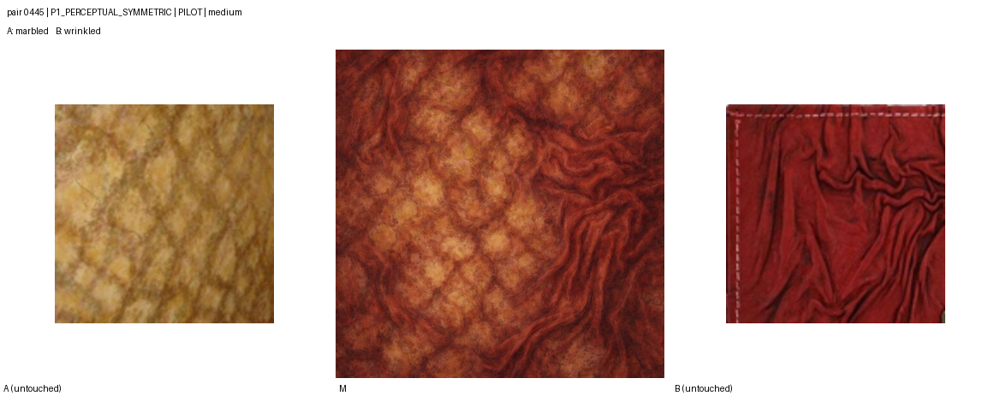

#### P2_SOURCE_LAYOUT — medium

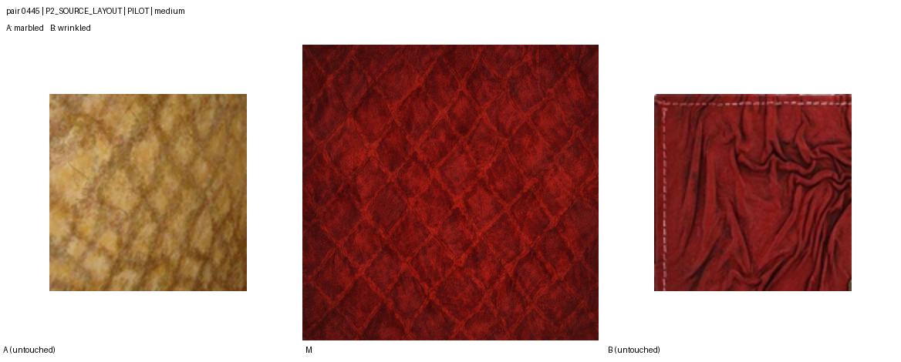

All three medium prompts produce coherent marbled/wrinkled textures. P2 is
strongly red, and its source-layout advantage is visually ambiguous here.

### Pair 0725 — periodic: crosshatched → meshed

#### P0_MINIMAL — medium

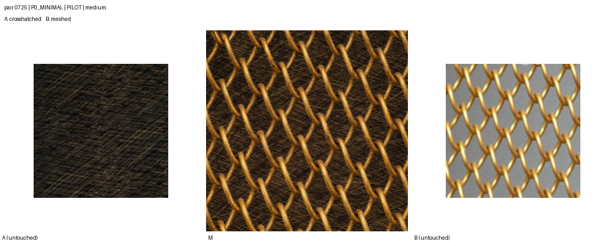

#### P1_PERCEPTUAL_SYMMETRIC — medium

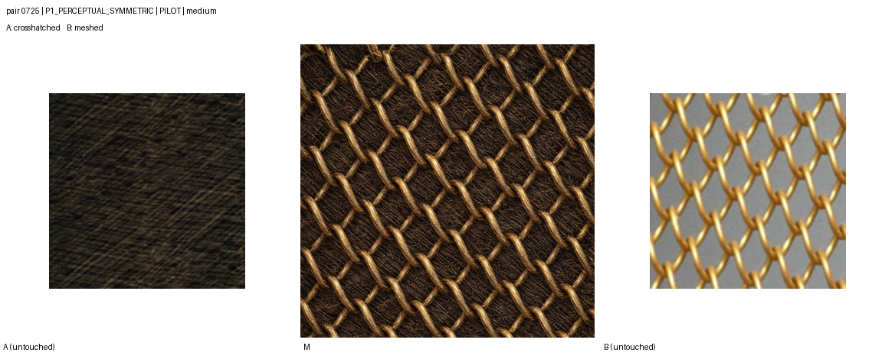

#### P2_SOURCE_LAYOUT — medium

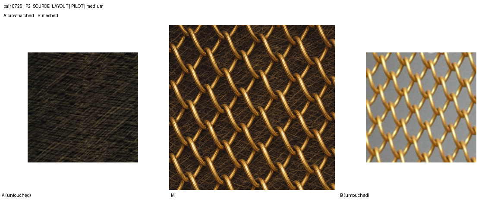

All three prompts produce coherent mesh-like textures, but each is visually
close to B's explicit mesh. Source-layout retention is weak or ambiguous.

### Pair 0656 — semantic intrusion: frilly → veined

#### P0_MINIMAL — medium

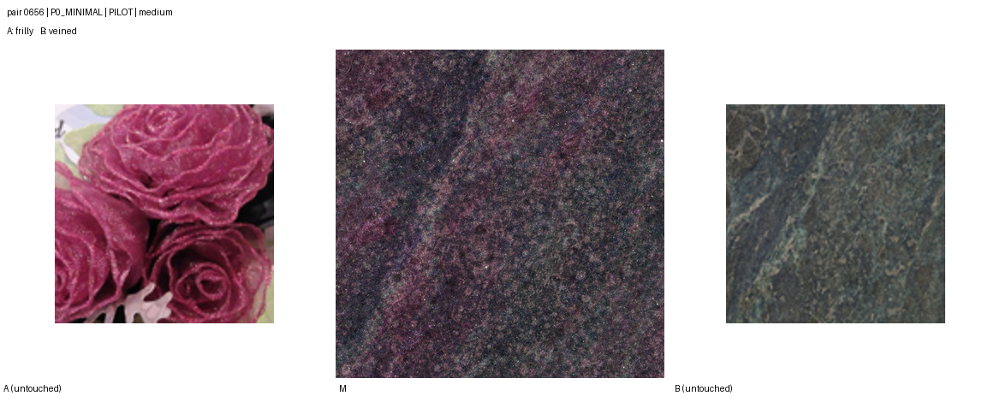

#### P1_PERCEPTUAL_SYMMETRIC — medium

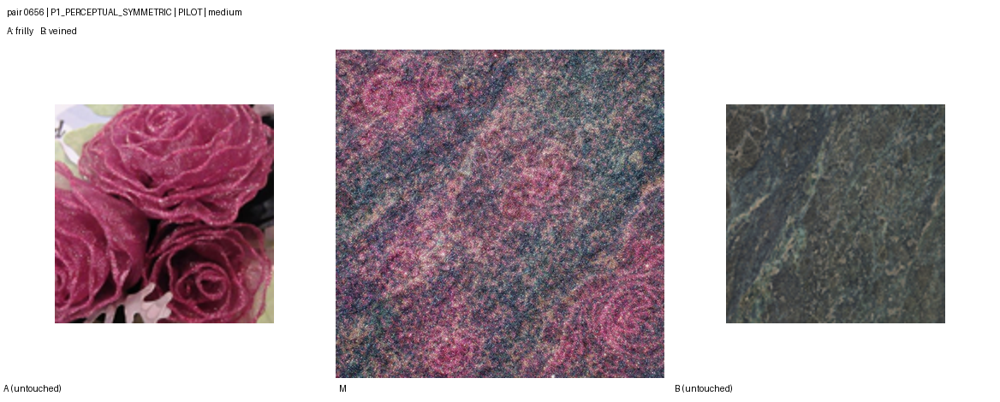

#### P2_SOURCE_LAYOUT — medium

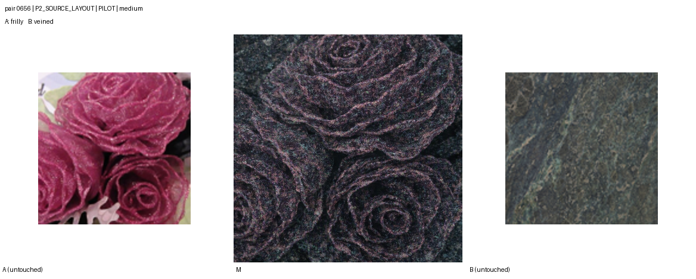

P0 suppresses explicit flower identity, P1 retains faint rose-like forms, and
P2 clearly retains A's flower layout with darker veined/material appearance
from B.

## Integrity summary

- 55 paid calls across both authorized previews: 55 successes, 0 failures, and
  no retries (10 initial plus 45 expanded).
- All outputs are original 1024×1024 RGB PNGs.
- Automated checks found no corrupt, blank, near-uniform, suspicious-border,
  or panel-like output. Exact duplicates are only the nine declared alias
  reuses across S1/S2/S3/S4.
- At the time of this preview the full experiment was unexecuted; its later
  authorized completion is documented at the end of this page.

See [`reports/EXPANDED_PREVIEW_REPORT.md`](reports/EXPANDED_PREVIEW_REPORT.md)
for execution details, [`reports/PILOT_REPORT.md`](reports/PILOT_REPORT.md) for
the first pilot, and [`EXPERIMENT_PLAN.md`](EXPERIMENT_PLAN.md) for the frozen
design.

## Full-run resource forecast

The 45-call high-quality preview took 1,621.83 seconds in total: a mean of
36.04 seconds per call, median 35.93 seconds, 90th percentile 40.11 seconds,
and maximum 51.31 seconds. The table below applies those measurements to the
remaining full experiment under the current serial-execution configuration.

| Series | Preview calls reused | New paid calls | Expected serial time | Conservative time | Exact output-image tokens | Estimated total tokens | Estimated Azure cost (USD)* |
|---|---:|---:|---:|---:|---:|---:|---:|
| S1 — directed P2 | 3 | 117 | 1h 10m | 1h 18m | 486,720 | ≈1,530,945 | **$26.24** |
| S2 — symmetric P1 | 3 | 117 | 1h 10m | 1h 18m | 486,720 | ≈1,532,349 | **$26.25** |
| S3 — prompt ablation | 0 | 24 | 14m | 16m | 99,840 | ≈310,728 | **$5.36** |
| S4 — symmetry/repeats | 0 | 72 | 43m | 48m | 299,520 | ≈942,984 | **$16.15** |
| S5 — full paths | 18 | 90 | 54m | 1h 00m | 374,400 | ≈1,176,210 | **$20.18** |
| S6 — analysis only | — | 0 | Local analysis only | — | 0 | 0 | **$0.00** |
| **Total remaining** | **24** | **420** | **4h 12m** | **4h 41m** | **1,747,200** | **≈5,493,216** | **$94.17** |

For operational planning, reserve **six hours**: projecting the slowest
observed preview latency across all 420 calls gives 5h 59m. This excludes local
feature extraction, metric computation, and human-study collection.

| Scope | Paid calls | Generation time | Output-image tokens | Estimated total tokens | Estimated Azure cost (USD)* |
|---|---:|---:|---:|---:|---:|
| Initial pilot — completed | 10 | 4m 25s | 9,776 | ≈98,510 | **$1.12** |
| Expanded preview — completed | 45 | 27m 02s | 187,200 | ≈588,123 | **$10.09** |
| Full run — remaining | 420 | ≈4h 12m | 1,747,200 | ≈5,493,216 | **$94.17** |
| **End-to-end total** | **475** | **≈4h 44m** | **1,944,176** | **≈6,179,849** | **$105.38** |

The output-token figures use the official value of 4,160 tokens for one
high-quality 1024×1024 image. Total-token estimates additionally include two
256×256 high-fidelity image inputs and the prompt. Exact Azure input-token
usage was not retained by the completed preview, so estimated totals are for
capacity planning rather than billing reconciliation. Future calls should
persist the API response's `usage` object.

\* USD estimates use the Azure Retail Prices API's `gpt img 1.5` Data Zone
meters available in East US 2 on 2026-09-01: $5.50 per million text-input
tokens, $8.80 per million image-input tokens, and $35.20 per million
image-output tokens. This is the conservative deployment-class assumption;
the corresponding Global Standard meters are exactly 10% lower, making the
remaining-run estimate **$85.61** and end-to-end estimate **$95.80**. Taxes,
private discounts, and local evaluation compute are excluded. See the
[Azure Retail Prices API](https://prices.azure.com/api/retail/prices) and the
official [image-generation cost and latency documentation](https://developers.openai.com/api/docs/guides/image-generation#cost-and-latency).

## Full S1–S6 execution — completed 2026-09-02

**[Open the complete, non-cherry-picked S1–S5 visual gallery](runs/full_pending_approval_20260901/FULL_GALLERY.md).**
It contains 12 pages for all 120 S1/P2 versus S2/P1 pairs, four S3 prompt
ablation pages, six S4 order/repeat pages, and three S5 path pages. Every panel
uses untouched A and B files around the generated midpoint or path frames.

| Series | Logical outputs | New paid calls | Exact preview reuses | API time | Azure Data Zone cost (USD) |
|---|---:|---:|---:|---:|---:|
| S1 — directed P2 | 120 | 117 | 3 | 75.4m | **$26.65** |
| S2 — symmetric P1 | 120 | 117 | 3 | 75.9m | **$26.65** |
| S3 — prompt ablation | 72 | 24 | 0 | 15.9m | **$5.45** |
| S4 — symmetry/repeats | 96 | 72 | 0 | 46.7m | **$16.37** |
| S5 — full paths | 108 | 90 | 18 | 58.4m | **$20.50** |
| S6 — analysis only | — | 0 | — | local | **$0.00** |
| **Full run total** | **516** | **420** | **24** | **4h 32m** | **$95.62** |

All 420 paid requests succeeded on their first API attempt. The 444-record
manifest has no failed request, no corrupt image, and no unexpected duplicate
primary output. Full-run usage was 5,632,496 tokens: 3,653,200 image-input,
105,455 text-input, 1,747,200 image-output, and 126,641 text-output. One saved
response lacked serialized usage after a local bookkeeping error, so its four
usage components are imputed from the median for the same frozen prompt; the
PNG, request metadata, and recovery provenance are retained.

| Completed scope | Paid calls | API generation time | Total tokens | Azure Data Zone cost (USD) |
|---|---:|---:|---:|---:|
| Initial pilot | 10 | 4m 25s | ≈98,510 | **$1.12** |
| Expanded preview | 45 | 27m 02s | ≈588,123 | **$10.09** |
| Full run | 420 | 4h 32m | 5,632,496 | **$95.62** |
| **End-to-end cumulative** | **475** | **≈5h 04m** | **≈6,319,129** | **≈$106.83** |

The pilot/preview rows remain estimates because their API usage payloads were
not persisted. Full-run cost uses recorded service usage except for the single
declared imputation. At the corresponding Global Standard retail meters, the
full run is $86.93 and the approximate cumulative total is $97.12. Taxes,
private discounts, storage, and local GPU evaluation are excluded.

### Main quantitative diagnostics

| Question | DINOv2 | LPIPS |
|---|---:|---:|
| P1 mean endpoint-balance error, 120 pairs | 0.1632 | 0.0630 |
| P2 mean endpoint-balance error, 120 pairs | 0.1854 | 0.0782 |
| P2 minus P1 paired difference (95% CI) | 0.0222 [0.0028, 0.0422] | 0.0152 [0.0051, 0.0251] |
| S4 order-effect / repeat-floor ratio | 1.3513 [1.2096, 1.5577] | 1.1001 [1.0473, 1.1584] |
| S5 mean coordinate monotonicity | 0.6333 | 0.6833 |
| S5 mean path-linearity R² | 0.5192 | 0.5779 |

P2’s stronger source bias is consistent with its directed source-layout
contract; its larger symmetric endpoint-balance error is therefore not, by
itself, a correctness failure. The S4 result shows that input order changes P1
outputs more than independent resampling alone. S5 gives only moderate path
monotonicity and linearity, supporting the preregistered interpretation as
prompt-controlled synthesis rather than a latent geodesic.

The automatic checker flagged six panel-like candidates. Post-hoc visual review
found five conservative false positives caused by grids/stripes/ruffles and one
plausible split-layout violation (S3/P0 pair 0841); all six remain included.
See the [full report](reports/FULL_RUN_REPORT.md), [visual-QC record](reports/VISUAL_QC.md),
and [human-study readiness note](human_study/READINESS.md).

These results describe a strong foundation-model comparator, not ground truth
or an oracle. KID/FID, cross-method tests against AAT/Gaussian/Texture Mixer,
and the frozen human-study trial build remain blocked by missing baseline
outputs, the fixed DTD reference-pool manifest, and the unrecovered original
128×128 evaluation transform. No participant study was deployed.
